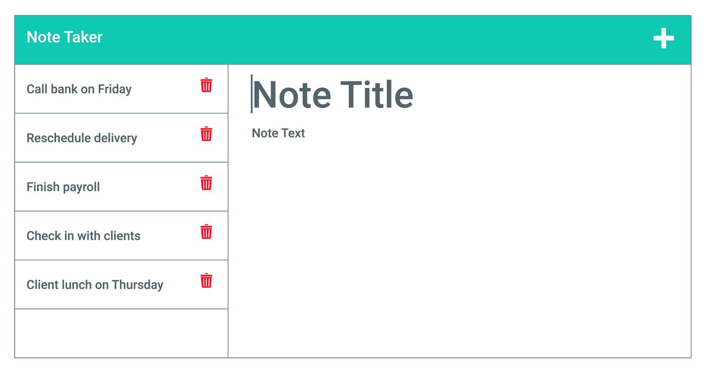

# Module 11 Challenge: Note Taker  

## Description

This project was built to allow the user to add and save notes to the notes webpage. It allows the user to title a note, add content and then save it, where it remains stored on the screen even when the page is refreshed so that information is never lost. This project was built so that the user may use this webpage to keep a list of notes. This project allowed me to apply the knowledge I’ve learned in class regarding Express, completing get and post routes so it may successfully grab the correct files. Throughout this project, I have learned how to use Express to complete the backend application.

## Usage

This webpage is used by entering desired text into the notes box. Once text is inputted and once the save button is clicked, the text is saved and stored in the local storage so that the user may access this information whenever they reload the page.

## Deployed Application

The live page is found at https://si-note-taker.herokuapp.com/.

## Demo

The webpage appears as the following:

## Credits

Sagiri Ikenaga
